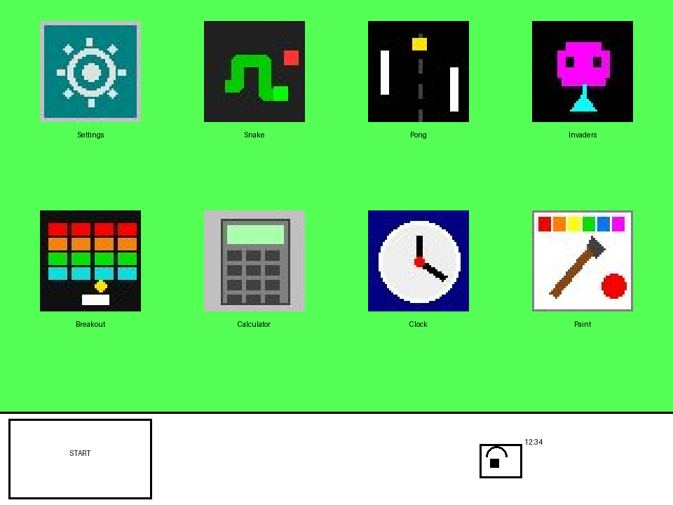

<p align="center">
  
</p>

**CYDOS** — a fast little OS for your CYD, made for small things.

<p align="center">
  
</p>

## Features

- Windows 1.0 style - flat chrome, green desktop, yellow title bars
- Apps are Lua files on the SD card - drop a folder in, reboot, done
- First boot installs everything by itself, wizard included
- Built-in Files, Editor, Images and Settings apps
- WiFi, clock sync and JSON configs, all editable right on the card

## Install

1. Flash the firmware: `scripts/build.sh && scripts/flash.sh`
2. Put any FAT32 SD card in the CYD
3. Power on - the setup wizard does the rest

Full requirements: [MOREINFO.md](MOREINFO.md)

## Usage

Tap an icon to launch an app. START opens the menu. Hold the BOOT button
for the power menu.

Want to write your own app? It's ~10 lines of Lua:
[HOWTOMAKEAPP.md](HOWTOMAKEAPP.md)

```lua
function init()
  gfx.cls(COLOR.BLACK)
  gfx.text(10, 40, "Hello CYDOS!", COLOR.WHITE, 3)
end

function onTouch(t, x, y)
  if t == TE_PRESS then beep(1000, 50) end
end
```

## License

Take it, do what you want with it - just say it is built on CYDOS.
See [LICENSE](LICENSE).
